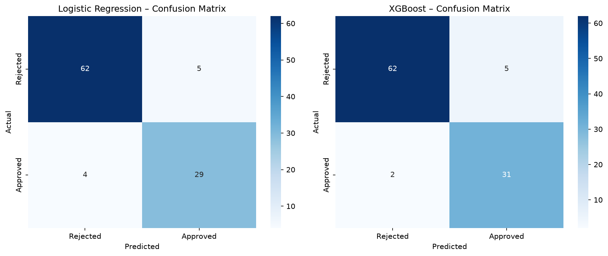

# Bank Customer Risk Engine

**Author:** Adebanji Oluwatimileyin Adelowo  
**Domain:** FinTech / Embeddings / Machine Learning

---

## Overview

An embedding-powered **customer risk assessment and product recommendation engine** for retail banking. Instead of storing customer profiles as structured rows, this system encodes them as dense semantic vectors using a sentence transformer model. These embeddings capture nuanced meaning that traditional features miss, enabling similarity search, cluster analysis, and powerful downstream ML models.

The final pipeline takes a plain-text customer description as input and outputs a complete risk decision: loan approval, default probability, and adjusted interest rate.

---

## Architecture

```
Customer Profile (text)
        │
        ▼
  all-MiniLM-L6-v2 Sentence Transformer
        │  384-dimensional embedding
        ▼
        ├──────────────────────────────────┐
        │                                  │
        │                     Transaction History (text)
        │                                  │
        │                     all-MiniLM-L6-v2
        │                                  │  384-dim
        │                                  ▼
        └─────── Concatenate (768-dim feature vector) ──────┐
                                                            │
                              ┌─────────────────────────────┤
                              │                             │
                    XGBoost Classifier            Multi-Output Regressor
                    (approval decision)           ├─ approval_prob
                                                  ├─ default_prob
                                                  └─ adjusted_rate
```

---

## Results

| Capability | Detail |
|-----------|--------|
| Embedding dimension | 384 (client) + 384 (transaction) = 768 combined |
| Customers modelled | 500 synthetic profiles |
| Products catalogue | 10 financial products |
| Transactions | 500 transaction records |
| Classifiers trained | XGBoost + Logistic Regression |
| Regression targets | approval_prob, default_prob, adjusted_rate (simultaneous) |
| Similarity search | Cosine nearest-neighbour over 500 embeddings |



*Approval classification on the 100-case test split (`03_Risk_Decision_Model.ipynb`). Logistic
regression (standardised features, regularisation chosen by cross-validation on the training split)
classifies 91 of 100 correctly; XGBoost classifies 93 of 100 (62 true rejections, 31 true
approvals, 5 false approvals, 2 false rejections).*

About two thirds of the cases are rejections, so the table compares against always predicting
"Rejected". The test split is over (customer, transaction) rows, and 66 of its 100 rows belong to
customers who also appear in the training split. The notebook therefore also reports 5-fold
cross-validation grouped by customer, which is the relevant estimate for a new customer:

| Model | Test split: balanced accuracy | Test split: ROC-AUC | Grouped by customer: balanced accuracy | Grouped by customer: approved-class F1 | Grouped by customer: ROC-AUC |
|---|---|---|---|---|---|
| Always "Rejected" | 0.50 | n/a | 0.50 | 0.00 | n/a |
| Logistic regression | 0.90 | 0.94 | 0.75 | 0.67 | 0.82 |
| XGBoost | 0.93 | 0.97 | 0.64 | 0.50 | 0.76 |

Both models learn more than the class prior, but much of the row-level test score comes from
customers seen in training. Repeating the grouped cross-validation over 10 different assignments of
customers to folds gives balanced accuracy 0.74 ± 0.02 for logistic regression and 0.64 ± 0.02 for
XGBoost (ROC-AUC 0.81 ± 0.02 and 0.77 ± 0.02), with logistic regression ahead in all 10. This is one
synthetic dataset of 500 rows from 305 customers, with XGBoost's hyperparameters fixed rather than
tuned, so it shows that XGBoost as configured here overfits to seen customers, not that logistic
regression is generally the better model. With the notebook's original default settings (unscaled 768-dim embeddings,
`C=1`), logistic regression predicted "Rejected" for every case: the embedding features vary by only
about 0.016 each, so default regularisation kept every predicted probability below 0.5.

---

## Notebooks

| Notebook | Description |
|----------|-------------|
| `01_Client_Embeddings.ipynb` | Generate 500 synthetic customer profiles, encode with `all-MiniLM-L6-v2`, save embeddings, UMAP 2D visualisation, cosine similarity search demo |
| `02_Product_Embeddings.ipynb` | 10-product financial catalogue + 500 transaction records, generate product and transaction embeddings, save to disk |
| `03_Risk_Decision_Model.ipynb` | Load and concatenate embeddings (768-dim), train XGBoost classifier + multi-output regressor, expose `risk_decision(customer: dict, transaction: dict)` end-to-end function |

**Run in order**, Notebook 3 loads pickle files produced by Notebooks 1 and 2.

---

## Sample Output

Actual saved output from `03_Risk_Decision_Model.ipynb` (Demo 1: a 40-year-old employed customer with a $120,000 income and a 780 credit score, applying for a $15,000 personal loan):

```python
strong_customer = {
    "age": 40, "annual_income": 120_000, "credit_score": 780,
    "account_balance": 25_000, "num_credit_cards": 2,
    "employment_years": 12, "employment_type": "Employed",
    "num_prev_loans": 3, "previous_default": 0,
    "monthly_expenses": 3_500, "num_dependents": 2,
    "debt_to_income": 0.35,
}
personal_loan = {
    "product_type": "Personal Loan", "amount": 15_000,
    "term_months": 36, "interest_rate": 8.5,
    "collateral": False, "risk_level": "Medium",
}

risk_decision(strong_customer, personal_loan)

# Returns:
{
  "approved":         False,
  "approval_score":   0.378,
  "default_prob":     0.298,
  "recommended_rate": 12.04,
}
```

The demo prints the notebook's own labelling rule alongside the model output: this profile satisfies the rule (`approved = True`), but the XGBoost model rejects it, as it does Demo 2 (which the rule also rejects). The decision comes from XGBoost, which the customer-grouped check above shows recalls only about 40% of approvals for customers it has not seen.

Customer and transaction text is built by one module, `notebooks/profile_text.py`, used by notebooks 01 and 02 for the training embeddings and by the demo for inference. Earlier, the demo formatted the text itself and differed from the training text in 11 places (for example it dropped the credit-score band, shortened field labels, and omitted the monthly instalment estimate). Using the training format raised Demo 1's approval score from 0.24 to 0.378, which is still below the 0.5 threshold. The training strings are unchanged by this refactor (all 500 customers and 500 transactions produce byte-identical text), so every metric above is unaffected. `tests/test_profile_text.py` checks the training format, that all notebooks use the shared functions, field order, and that missing fields raise an error instead of being filled with defaults.

---

## Key Concepts

**Why embeddings over structured features?**  
Traditional risk models require hand-crafted feature engineering. Sentence embeddings capture semantic relationships directly from text, "software engineer with stable employment" and "senior developer with consistent income" map to nearby points in embedding space without any explicit rules.

**UMAP Visualisation**  
Reduces 384-dim embeddings to 2D for visual inspection (`notebooks/client_embeddings_umap.png`). The saved plot shows several tight clusters, but they are not ordered by credit score or by income, and the notebook does not analyse which profile fields separate them. The profiles are synthetic: numeric fields such as income and credit score are drawn independently at random in `01_Client_Embeddings.ipynb`.

**Multi-output Regression**  
Approval score, default probability, and adjusted interest rate are predicted by scikit-learn's `MultiOutputRegressor` wrapping `GradientBoostingRegressor`, which fits one independent regressor per target; the three outputs are not constrained to be consistent with each other.

---

## Requirements

```bash
pip install -r requirements.txt
```

No API keys required, all models run locally.

---

## Project Structure

```
03-bank-customer-risk-engine/
├── README.md
├── requirements.txt
├── tests/
│   └── test_profile_text.py      # train/inference text consistency (pytest tests/)
└── notebooks/
    ├── profile_text.py           # canonical customer/transaction text used for every embedding
    ├── 01_Client_Embeddings.ipynb
    ├── 02_Product_Embeddings.ipynb
    └── 03_Risk_Decision_Model.ipynb
```

Artifacts written by the notebooks:
- committed: UMAP charts and confusion matrices (`notebooks/*.png`)
- gitignored: `client_embeddings.pkl`, `transaction_embeddings.pkl`, `product_catalogue_embeddings.pkl`
